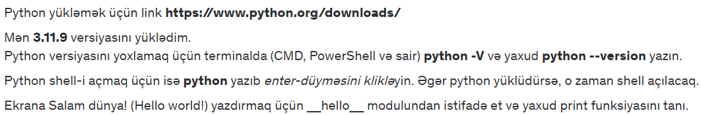

### Youtube Kanalımın Linki
<a href="https://youtube.com/@pyterminator">Kanala bax</a>

### Dərs 1-in açıqlaması
Python yükləmək üçün <a href="https://www.python.org/downloads/">link</a>  
Mən <b>3.11.9</b> versiyasını yüklədim.Python versiyasını yoxlamaq üçün terminalda (CMD, PowerShell və sair) <b>python -V</b> və yaxud <b>python --version</b> yazın.

Python shell-i açmaq üçün isə <b>python</b> yazıb enter-düyməsini klikləyin. Əgər python yüklüdürsə, o zaman shell açılacaq.

Ekrana Salam dünya! (Hello world!) yazdırmaq üçün <b>__hello__</b> modulundan istifadə et və yaxud <b>print</b> funksiyasını tanı.

 

